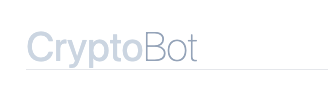

<div align="left">



</div>

<br>

Bot de trading de crypto-monnaies basé sur un modèle de Machine Learning. Projet réalisé dans le cadre de la formation MLOPs DataScientest, promotion Mai 2023.

_Auteurs - Johann, Julien Le Bot, Christopher Corbin_

## Architecture de la solution

TODO: diagramme

## Installation et lancement

**Pré-requis :**  Docker >= 24.0.5, Python >= 3.9.18

Depuis un terminal, cloner le dépôt et se positionner dans le projet: 

```sh
git clone https://github.com/JohannGump/CryptoBot-Binance.git
cd CryptoBot-Binance
```

_Optionnel (ie. auto-completion VSCode, execution des scripts sur hôte)_

Créer un environnement virtuel Python dans le projet et installer les dépendances des modules:

```sh
python -m venv .venv
source .venv/bin/activate
pip install -r binance_bridge/requirements.txt
pip install -r data/requirements.txt
pip install -r model/requirements.txt
pip install -r web_api/requirements.txt
```

Executez le compose file pour ???

```sh
docker compose up
```

Patientez 2/3 minutes puis naviguez à l'adresse suivante pour accéder à la vitrine de l'application: [http://localhost:8000](http://localhost:8000)

L'accès à l'interface Airflow est disponible ici (login: airflow, mdp: airflow): [http://localhost:8080](http://localhost:8080)

## Organisation du code

- _airflow_ : dags airflows
- _airflow-setup_ : manifests de déploiement d'Airflow sur le cluster Kubernetes
- _binance_bridge_ : utilitaires de communication avec l'API Binance, définitions des constantes
- _data_ : scripts _etl_ des données d'entrainement, build file Docker
- _kubernetes_ : manifests de déploiment de la solution sur cluster Kubernetes
- _model_ : scripts d'entrainement (preprocessing, fit, save) des modèles, build files Docker (entraineur de modèles, serveur de modèles)
- _requester_ : etl données de prédictions, requêteur de prédcitions
- _web_api_ : vitrine publique de l'application